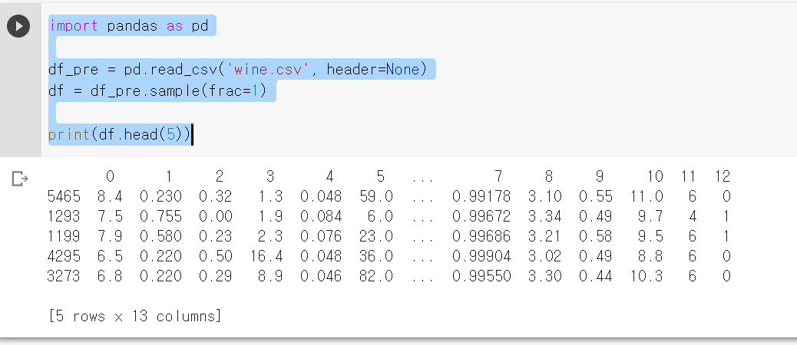
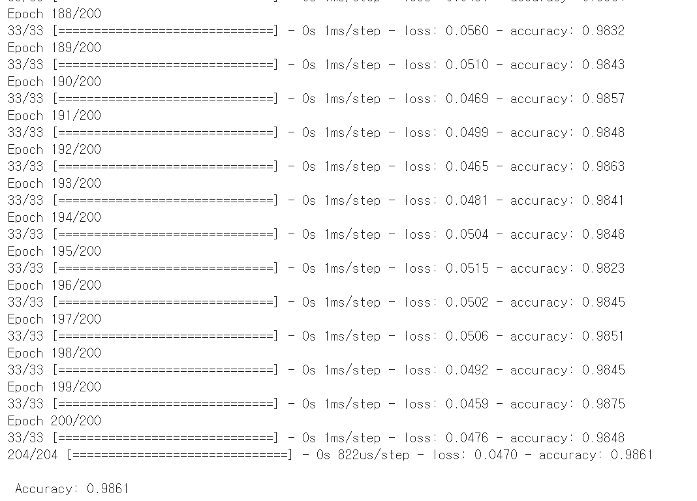

## K겹 교차검증 (K-fold cross validation)
 -> 데이터가 충분하지 않을 때, 단점을 보완하기 위한 방법.

 >  데이터셋을 여러 개로 나누어 하나씩 테스트셋으로 사용하고 나머지를 모두 합해서 학습셋으로 사용하는 방법.

 >  sklearn과 StratifiedKFold() 함수 사용.

 # CHAP 13 - 베스트 모델 만들기

``` Python
 
import pandas as pd

df_pre = pd.read_csv('wine.csv', header=None)
df = df_pre.sample(frac=1)

print(df.head(5))
```



``` Python
from keras.models import Sequential
from keras.layers import Dense
from keras.callbacks import ModelCheckpoint, EarlyStopping

import pandas as pd
import numpy
import tensorflow as tf
import matplotlib.pyplot as plt

seed = 0
numpy.random.seed(seed)
tf.random.set_seed(3)

df_pre = pd.read_csv('wine.csv', header=None)
df = df_pre.sample(frac=1)
dataset = df.values
X = dataset[:,0:12]
Y = dataset[:,12]

model = Sequential()
model.add(Dense(30, input_dim=12, activation='relu'))
model.add(Dense(12, activation='relu'))
model.add(Dense(8, activation='relu'))
model.add(Dense(1, activation='sigmoid'))

model.compile(loss = 'binary_crossentropy', optimizer='adam', metrics=['accuracy'])

model.fit(X, Y, epochs=200, batch_size=200)

print("\n Accuracy: %.4f" % (model.evaluate(X, Y)[1]))
```



# CHAP 15 - 선형 회귀 적용하기

