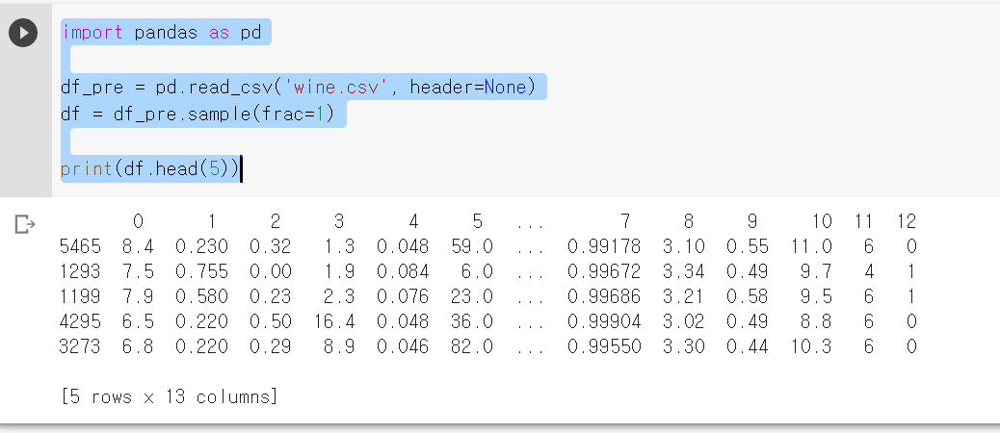
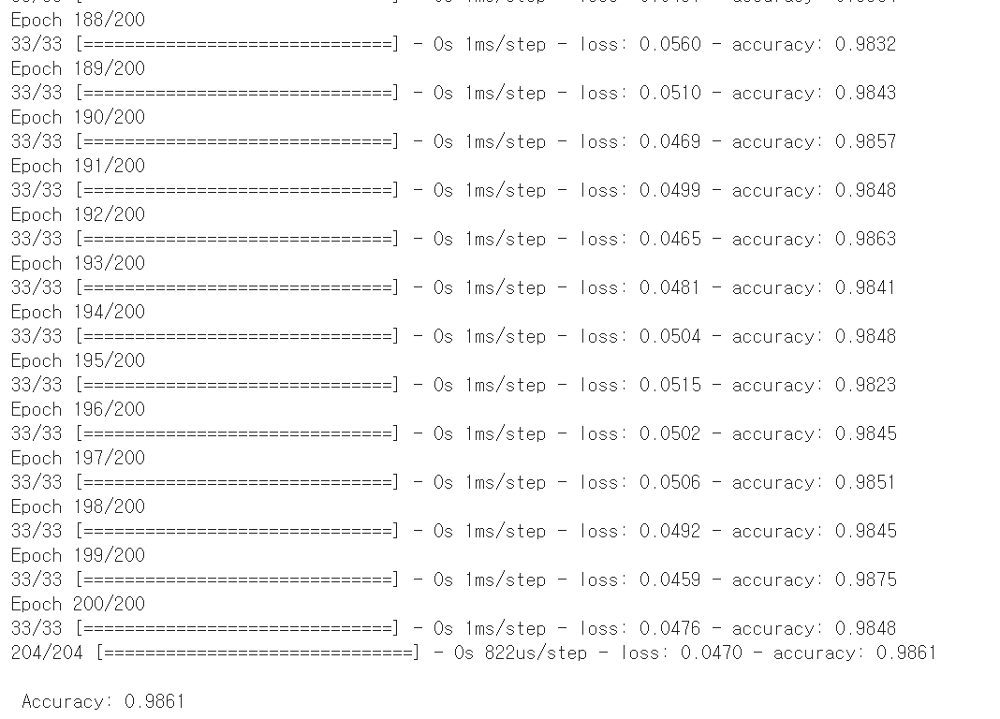
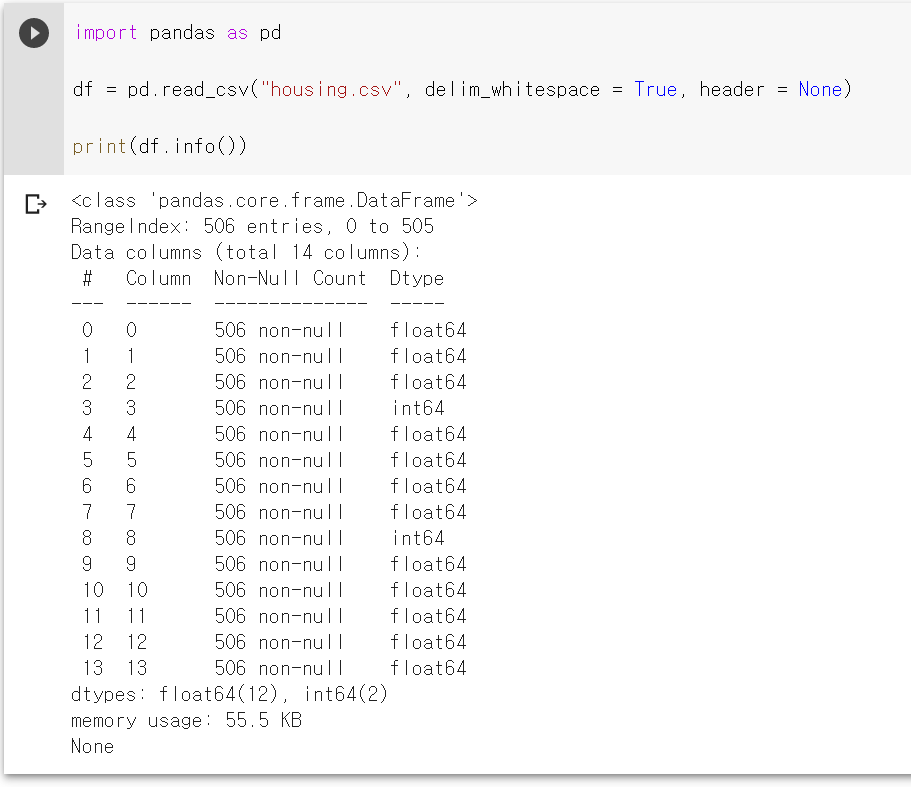
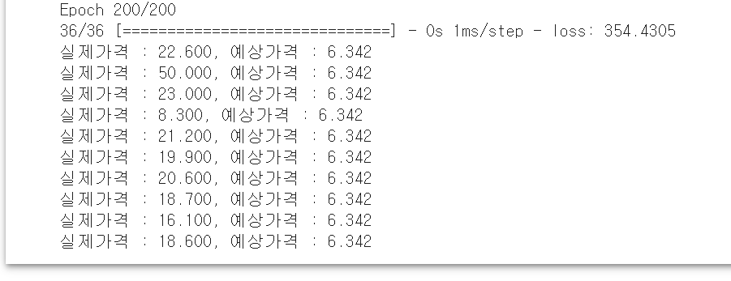
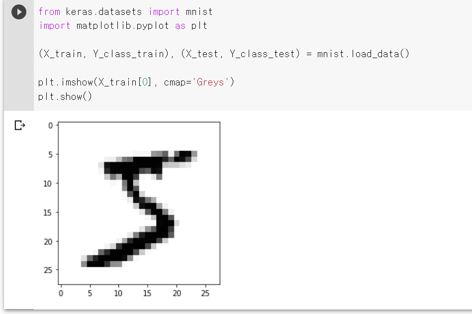

## 학부 연구실 연수 일지

**연수기간** 2020.09 ~ 진행중  
**참여연구실** 안상태 교수님, 뇌 인공지능 연구실   


## Deep_Learning Study  

교재 : **모두의 딥러닝** 


## K겹 교차검증 (K-fold cross validation)
 -> 데이터가 충분하지 않을 때, 단점을 보완하기 위한 방법.

 >  데이터셋을 여러 개로 나누어 하나씩 테스트셋으로 사용하고 나머지를 모두 합해서 학습셋으로 사용하는 방법.

 >  sklearn과 StratifiedKFold() 함수 사용.

 # CHAP 13 - 베스트 모델 만들기

``` Python
 
import pandas as pd

df_pre = pd.read_csv('wine.csv', header=None)
df = df_pre.sample(frac=1)

print(df.head(5))
```



``` Python
from keras.models import Sequential
from keras.layers import Dense
from keras.callbacks import ModelCheckpoint, EarlyStopping

import pandas as pd
import numpy
import tensorflow as tf
import matplotlib.pyplot as plt

seed = 0
numpy.random.seed(seed)
tf.random.set_seed(3)

df_pre = pd.read_csv('wine.csv', header=None)
df = df_pre.sample(frac=1)
dataset = df.values
X = dataset[:,0:12]
Y = dataset[:,12]

model = Sequential()
model.add(Dense(30, input_dim=12, activation='relu'))
model.add(Dense(12, activation='relu'))
model.add(Dense(8, activation='relu'))
model.add(Dense(1, activation='sigmoid'))

model.compile(loss = 'binary_crossentropy', optimizer='adam', metrics=['accuracy'])

model.fit(X, Y, epochs=200, batch_size=200)

print("\n Accuracy: %.4f" % (model.evaluate(X, Y)[1]))
```



# CHAP 15 - 선형 회귀 적용하기
1. 데이터 확인하기


-> 총 sample 수 506개
-> column 수 14개 -> 13개의 속성과 1개의 클래스

``` python
from keras.models import Sequential
from keras.layers import Dense
from sklearn.model_selection import train_test_split

import numpy
import pandas as pd
import tensorflow as tf

seed = 0
numpy.random.seed(seed)
tf.random.set_seed(3)

df = pd.read_csv("housing.csv", delim_whitespace=True, header=None)

dataset = df.values
X = dataset[:, 0:13]
Y = dataset[:, 13]
X_train, X_test, Y_train, Y_test = train_test_split(X, Y, test_size = 0.3, random_state = seed)

model = Sequential()
model.add(Dense(30, input_dim=13, activation = 'relu'))
model.add(Dense(6, activation = 'relu'))
model.add(Dense(1))
model.compile(loss = 'mean_squared_error', optimizer = 'adam')
model.fit(X_train, Y_train, epochs=200, batch_size=10)

Y_prediction = model.predict(X_test).flatten()

for i in range(10):
  label = Y_test[i]
  prediction = Y_prediction[i]
  print("실제가격 : {:.3f}, 예상가격 : {:.3f}".format(label, prediction))
```



-> 실제 가격과 예상가격이 비례하여 변화한다.

# chap 16 - CNN



딥러닝을 돌리기 전 데이터 전처리 과정

```Python
from keras.datasets import mnist
from keras.utils import np_utils
import numpy as np
import matplotlib.pyplot as plt

(X_train, Y_class_train), (X_test, Y_class_test) = mnist.load_data()

plt.imshow(X_train[0], cmap='Greys')
plt.show()

X_train = X_train.reshape(X_train.shape[0], 784)

X_train = X_train.astype('float64')
X_train = X_train / 255

X_test = X_test.reshape(X_test.shape[0], 784).astype('float64') / 255

Y_train = np_utils.to_categorical(Y_class_train, 10)
Y_test = np_utils.to_categorical(Y_class_test, 10)
print(Y_train[0])
```